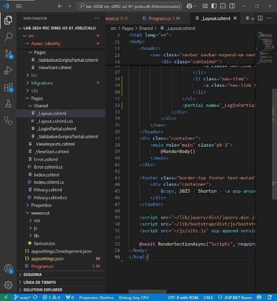

**SESION DE LABORATORIO N° 02: Construyendo una Aplicación Web con ASP.NET y Entity Framework** 

**OBJETIVOS** 

- Comprender el desarrollo una Aplicación Web utilizando ASP.NET y Entity Framework 

**REQUERIMIENTOS** 

- Conocimientos: 
  - Conocimientos básicos de SQL. 
  - Conocimientos shell y comandos en modo terminal.
- Hardware: 
  - Virtualization activada en el BIOS. 
  - CPU SLAT-capable feature. 
  - Al menos 4GB de RAM. 
- Software: 
- Windows 10 64bit: Pro, Enterprise o Education (1607 Anniversary Update, Build 14393 o Superior) 
- Docker Desktop 
- Powershell versión 7.x 
- .Net 8 
- Azure CLI 

**CONSIDERACIONES INICIALES** 

**Tener una cuenta en Infracost ([https://www.infracost.io/), sino](https://www.infracost.io/) utilizar �** 

**su** 

cuenta de github para generar su cuenta y generar un token.

- Tener una cuenta en SonarCloud (h[ttps://sonarcloud.io/), sino](https://sonarcloud.io/) utilizar su cuenta de github para generar su cuenta y generar un token. El token debera estar registrado en su repositorio de Github con el nombre de

**Tener una cuenta en Infracost ([https://www.infracost.io/), sino](https://www.infracost.io/) utilizar �** 

**su** 

SONAR\_TOKEN. 

- Tener una cuenta con suscripción en Azure (ht[tps://portal.azure.com/). ](https://portal.azure.com/)Tener el ID de la Suscripción, que se utilizará en el laboratorio
- Clonar el repositorio mediante git para tener los recursos necesarios en una ubicación que no sea restringida del sistema.

**DESARROLLO** 

**PREPARACION DE LA INFRAESTRUCTURA** 

1. Iniciar la aplicación Powershell o Windows Terminal en modo administrador, ubicarse en ua ruta donde se ha realizado la clonación del repositorio 

md infra 

2. Abrir Visual Studio Code, seguidamente abrir la carpeta del repositorio clonado del laboratorio, en el folder Infra, crear el archivo main.tf con el siguiente contenido 

terraform { required\_providers { azurerm = { 

source = "hashicorp/azurerm" version = "~> 4.0.0" } 

} 

required\_version = ">= 0.14.9" 

} 

variable "suscription\_id" { 

type = string 

description = "Azure subscription id" } 

variable "sqladmin\_username" { type = string description = "Administrator username for server" } variable "sqladmin\_password" { 

type = string 

description = "Administrator password for server" } provider "azurerm" { 

features {} 

subscription\_id = var.suscription\_id } 

- Generate a random integer to create a globally unique name resource "random\_integer" "ri" { 

min = 100 

max = 999 

} 

- Create the resource group 

resource "azurerm\_resource\_group" "rg" { 

name = "upt-arg-${random\_integer.ri.result}" location = "eastus" } 

- Create the Linux App Service Plan 

resource "azurerm\_service\_plan" "appserviceplan" {

name = "upt-asp-${random\_integer.ri.result}" location = azurerm\_resource\_group.rg.location

resource\_group\_name = azurerm\_resource\_group.rg.name os\_type = "Linux" 

sku\_name = "F1" 

} 

- Create the web app, pass in the App Service Plan ID

resource "azurerm\_linux\_web\_app" "webapp" { 

name = "upt-awa-${random\_integer.ri.result}" location = azurerm\_resource\_group.rg.location

resource\_group\_name = azurerm\_resource\_group.rg.name

service\_plan\_id = azurerm\_service\_plan.appserviceplan.id depends\_on = [azurerm\_service\_plan.appserviceplan] //https\_only = true

site\_config { 

minimum\_tls\_version = "1.2" 

always\_on = false 

application\_stack { 

docker\_image\_name = "patrickcuadros/shorten:latest" docker\_registry\_url = "[https://index.docker.io" ](https://index.docker.io/)

} 

} 

} 

resource "azurerm\_mssql\_server" "sqlsrv" { 

name = "upt-dbs-${random\_integer.ri.result}" resource\_group\_name = azurerm\_resource\_group.rg.name

location = azurerm\_resource\_group.rg.location

version = "12.0" 

administrator\_login = var.sqladmin\_username

administrator\_login\_password = var.sqladmin\_password

} 

resource "azurerm\_mssql\_firewall\_rule" "sqlaccessrule" { name = "PublicAccess"

server\_id = azurerm\_mssql\_server.sqlsrv.id

start\_ip\_address = "0.0.0.0" 

end\_ip\_address = "255.255.255.255" 

} 

resource "azurerm\_mssql\_database" "sqldb" { name = "shorten" server\_id = azurerm\_mssql\_server.sqlsrv.id sku\_name = "Free" } 

3. Abrir un navegador de internet y dirigirse a su repositorio en Github, en la sección *Settings*, buscar la opción *Secrets and Variables* y seleccionar la opción *Actions*. Dentro de esta crear los siguientes secretos

AZURE\_USERNAME: Correo o usuario de cuenta de Azure AZURE\_PASSWORD: Password de cuenta de Azure SUSCRIPTION\_ID: ID de la Suscripción de cuenta de Azure SQL\_USER: Usuario administrador de la base de datos, ejm: adminsql SQL\_PASS: Password del usuario administrador de la base de datos, ejm: upt.2025

5. En el Visual Studio Code, crear la carpeta .github/workflows en la raiz del proyecto, seguidamente crear el archivo deploy.yml con el siguiente contenido 

Click to expand: deploy.yml 

6. En el Visual Studio Code, guardar los cambios y subir los cambios al repositorio. Revisar los logs de la ejeuciòn de automatizaciòn y anotar el numero de identificaciòn de Grupo de Recursos y Aplicación Web creados

azurerm\_linux\_web\_app.webapp: Creation complete after 53s [id=/subscriptions/1f57de72-50fd-4271-8ab9- 3fc129f02bc0/resourceGroups/upt - arg- XXX/providers/Microsoft.Web/sites/upt-awa-XXX] 

**CONSTRUCCION DE LA APLICACION** 

1. En el terminal, ubicarse en un ruta que no sea del sistema y ejecutar los siguientes comandos. 

dotnet new webapp -o src -n Shorten cd src 

dotnet tool install -g dotnet-aspnet-codegenerator --version 8.0.0 dotnet add package Microsoft.AspNetCore.Identity.UI --version 8.0.0 dotnet add package Microsoft.AspNetCore.Identity.EntityFrameworkCore - -version 8.0.0 

dotnet add package Microsoft.EntityFrameworkCore.Design -- version=8.0.0 dotnet add package Microsoft.EntityFrameworkCore.SqlServer -- version=8.0.0 

dotnet add package Microsoft.EntityFrameworkCore.Tools --version=8.0.0 dotnet add package Microsoft.VisualStudio.Web.CodeGeneration.Design -- version=8.0.0 

dotnet add package Microsoft.AspNetCore.Components.QuickGrid -- version=8.0.0 

dotnet add package Microsoft.AspNetCore.Components.QuickGrid.EntityFrameworkAdapter -- version=8.0.0 

2. En el terminal, ejecutar el siguiente comando para crear los modelos de autenticación de identidad dentro de la aplicación.

dotnet aspnet-codegenerator identity –useDefaultUI 

3. En el VS Code, modificar la cadena de conexión de la base de datos en el archivo appsettings.json, de la siguiente manera:

"ShortenIdentityDbContextConnection": "Server=tcp:upt-dbs- XXX.database.windows.net,1433;Initial Catalog=shorten;Persist Security Info=False;User ID=YYY;Password=ZZZ;MultipleActiveResultSets=False;Encrypt=True;TrustS erverCertificate=False;Connection Timeout=30;" 

Donde: XXX, id de su servidor de base de datos YYY, usuario administrador de base de datos ZZZ, password del usuario de base de datos

4. En el terminal, ejecutar el siguiente comando para crear las tablas de base de datos de identidad. 

dotnet ef migrations add CreateIdentitySchema dotnet ef database update

5. En el Visual Studio Code, en la carpeta src/Areas/Domain, crear el archivo UrlMapping.cs con el siguiente contenido:

namespace Shorten.Areas.Domain;

/// 

/// Clase de dominio que representa una acortaciòn de url /// public class UrlMapping 

{ 

/// 

/// Identificador del mapeo de url 

/// 

/// Entero 

public int Id { get; set; } 

/// 

/// Valor original de la url 

/// 

/// Cadena 

public string OriginalUrl { get; set; } = string.Empty; /// /// Valor corto de la url 

/// 

/// Cadena 

public string ShortenedUrl { get; set; } = string.Empty; } 

6. En el Visual Studio Code, en la carpeta src/Areas/Domain, crear el archivo ShortenContext.cs con el siguiente contenido:

using Microsoft.EntityFrameworkCore; 

namespace Shorten.Models;

/// 

/// Clase de infraestructura que representa el contexto de la base de datos /// 

using Microsoft.EntityFrameworkCore; 

namespace Shorten.Areas.Domain;

/// 

/// Clase de infraestructura que representa el contexto de la base de datos /// 

public class ShortenContext : DbContext

{ 

/// 

/// Constructor de la clase

/// 

/// opciones de conexiòn de BD 

public ShortenContext(DbContextOptions options) : base(options)

{ 

} 

/// 

/// Propiedad que representa la tabla de mapeo de urls ///

/// Conjunto de UrlMapping 

public DbSet UrlMappings { get; set; } 

} 

7. En el Visual Studio Code, en la carpeta src, modificar el archivo Program.cs con el siguiente contenido al inicio: 

using Microsoft.AspNetCore.Identity; 

using Microsoft.EntityFrameworkCore; 

using Shorten.Areas.Identity.Data; 

using Shorten.Areas.Domain; 

var builder = WebApplication.CreateBuilder(args); 

var connectionString = builder.Configuration.GetConnectionString("ShortenIdentityDbContextCon nection") ?? throw new InvalidOperationException("Connection string 'ShortenIdentityDbContextConnection' not found.");

builder.Services.AddDbContext(options => options.UseSqlServer(connectionString));

builder.Services.AddDefaultIdentity(options => options.SignIn.RequireConfirmedAccount = true).AddEntityFrameworkStores();

builder.Services.AddDbContext(options => options.UseSqlServer(connectionString)); builder.Services.AddQuickGridEntityFrameworkAdapter();

// Add services to the container. builder.Services.AddRazorPages(); var app = builder.Build(); 

// Configure the HTTP request pipeline. 

if (!app.Environment.IsDevelopment()) 

{ 

app.UseExceptionHandler("/Error"); 

// The default HSTS value is 30 days. You may want to change this for production scenarios, see [https://aka.ms/aspnetcore-hsts. ](https://aka.ms/aspnetcore-hsts)

app.UseHsts(); 

} 

app.UseHttpsRedirection(); app.UseStaticFiles();

app.UseRouting(); app.UseAuthorization(); app.MapRazorPages(); app.Run();

8. En el terminal, ejecutar los siguientes comandos para realizar la migración de la entidad UrlMapping 

dotnet ef migrations add DomainModel --context ShortenContext dotnet ef database update --context ShortenContext 

9. En el terminal, ejecutar el siguiente comando para crear nu nuevo controlador y sus vistas asociadas.

dotnet aspnet-codegenerator razorpage Index List -m UrlMapping -dc ShortenContext -outDir Pages/UrlMapping -udl 

dotnet aspnet-codegenerator razorpage Create Create -m UrlMapping -dc ShortenContext -outDir Pages/UrlMapping -udl 

dotnet aspnet-codegenerator razorpage Edit Edit -m UrlMapping -dc ShortenContext -outDir Pages/UrlMapping -udl 

dotnet aspnet-codegenerator razorpage Delete Delete ShortenContext -outDir Pages/UrlMapping -udl 

dotnet aspnet-codegenerator razorpage Details Details ShortenContext -outDir Pages/UrlMapping -udl 

-m UrlMapping -dc 

-m UrlMapping - dc 

10. En el Visual Studio Code, en la carpeta src, modificar el archivo \_Layout.cshtml, Adicionando la siguiente opciòn dentro del navegador:

<title>@ViewData["Title"] - Shorten</title> Shorten 

<button class="navbar-toggler" type="button" data-bs- toggle="collapse" data-bs- target=".navbar-collapse" aria- controls="navbarSupportedContent"

aria-expanded="false" aria-label="Toggle navigation"> 

- Home 
- Privacy 
- Shorten 

@RenderBody() 

© 2025 - Shorten - Privacy 

  @await RenderSectionAsync("Scripts", required: false)

11. En el Visual Studio Code, en la carpeta raiz del proyecto, crear un nuevo archivo Dockerfile con el siguiente contenido:
- Utilizar la imagen base de .NET SDK 

FROM mcr.microsoft.com/dotnet/sdk:8.0 AS build

- Establecer el directorio de trabajo WORKDIR /app 
- Copiar el resto de la aplicación y compilar COPY src/. ./

RUN dotnet restore 

RUN dotnet publish -c Release -o out 

- Utilizar la imagen base de .NET Runtime 

FROM mcr.microsoft.com/dotnet/aspnet:8.0-alpine AS runtime LABEL org.opencontainers.image.source="ht[tps://github.com/p- cuadr](https://github.com/p-)os/Shorten02" 

- Establecer el directorio de trabajo

WORKDIR /app 

ENV ASPNETCORE\_URLS=http://+:80 RUN apk add icu-libs 

ENV DOTNET\_SYSTEM\_GLOBALIZATION\_INVARIANT=false 

- Copiar los archivos compilados desde la etapa de construcción COPY -- from=build /app/out . 
- Definir el comando de entrada para ejecutar la aplicación ENTRYPOINT ["dotnet", "Shorten.dll"] 

**DESPLIEGUE DE LA APLICACION** 

1. En el terminal, ejecutar el siguiente comando para obtener el perfil publico (Publish Profile) de la aplicación. Anotarlo porque se utilizara posteriormente. 

az webapp deployment list-publishing-profiles --name upt-awa-XXX -- resource - group upt -arg-XXX --xml 

Donde XXX; es el numero de identicación de la Aplicación Web creada en la primera sección 

2. Abrir un navegador de internet y dirigirse a su repositorio en Github, en la sección *Settings*, buscar la opción *Secrets and Variables* y seleccionar la opción *Actions*. Dentro de esta hacer click en el botón *New Repository* 

   *Secret*. En el navegador, dentro de la ventana *New Secret*, colocar como 

   nombre AZURE\_WEBAPP\_PUBLISH\_PROFILE y como valor el obtenido en el paso anterior. 

3. En el Visual Studio Code, dentro de la carpeta .github/workflows, crear el archivo ci-cd.yml con el siguiente contenido

name: Construcción y despliegue de una aplicación MVC a Azure env: 

AZURE\_WEBAPP\_NAME: upt-awa-XXX # Aqui va el nombre de su aplicación DOTNET\_VERSION: '8' # la versión de .NET 

on: 

push: 

branches: [ "main" ] 

paths: 

- 'src/\*\*' 
- '.github/workflows/\*\*' 

workflow\_dispatch: 

permissions: 

contents: read 

packages: write 

jobs: 

build: 

runs-on: ubuntu-latest 

steps: 

- uses: actions/checkout@v4
- name: 'Login to GitHub Container Registry' 

uses: docker/login-action@v3 

with: 

registry: ghcr.io 

username: ${{github.actor}} 

password: ${{secrets.GITHUB\_TOKEN}} 

- name: 'Build Inventory Image' 

run: | 

docker build . --tag ghcr.io/${{github.actor}}/shorten:${{github.sha}} docker push ghcr.io/${{github.actor}}/shorten:${{github.sha}} 

deploy: 

permissions: 

contents: none 

runs-on: ubuntu-latest 

needs: build 

environment: 

name: 'Development' 

url: ${{ steps.deploy-to-webapp.outputs.webapp-url }} steps: 

- name: Desplegar a Azure Web App 

id: deploy-to-webapp 

uses: azure/webapps-deploy@v2 

with: 

app -name: ${{ env.AZURE\_WEBAPP\_NAME }} 

publish -profile: ${{ secrets.AZURE\_WEBAPP\_PUBLISH\_PROFILE }} images: ghcr.io/${{github.actor}}/shorten:${{github.sha}} 

4. En el Visual Studio Code o en el Terminal, confirmar los cambios con sistema de controlde versiones (git add ... git commit...) y luego subir esos cambios al repositorio remoto (git push ...).

5. En el Navegador de internet, dirigirse al repositorio de Github y revisar la seccion Actions, verificar que se esta ejecutando correctamente el Workflow. 

6. En el Navegador de internet, una vez finalizada la automatización, ingresar al sitio creado y navegar por el ([https://upt-awa- XXX.azurewebsites.net). ](https://upt-awa-xxx.azurewebsites.net/)
7. En el Terminal, revisar las metricas de navegacion con el siguiente comando. 

az monitor metrics list --resource "/subscriptions/XXXXXXXXXXXXXXX/resourceGroups/upt-arg- XXX/providers/Microsoft.Web/sites/upt-awa-XXXX" --metric "Requests" -- start - time 2025-01-07T18:00:00Z --end-time 2025-01-07T23:00:00Z -- output table 

Reemplazar los valores: 1. ID de suscripcion de Azure, 2. ID de creaciòn de infra y 3. El rango de fechas de uso de la aplicación.

7. En el Terminal, ejecutar el siguiente comando para obtener la plantilla de los recursos creados de azure en el grupo de recursos UPT.

az group export -n upt-arg-XXX > lab\_01.json 

8. En el Visual Studio Code, instalar la extensión *ARM Template Viewer*, abrir el archivo lab\_02.json y hacer click en el icono de previsualizar ARM.

**ACTIVIDADES ENCARGADAS** 

1. Subir el diagrama al repositorio como lab\_02.png y el reporte de metricas.
1. Realizar el scanero del codigo de terraform utilizando TfSec o Trivy dentro del Github Action. 
1. En la aplicación completar el envio de correo para el registro de usuarios [(https://learn.microsoft.com/es- ](https://learn.microsoft.com/es-es/aspnet/core/security/authentication/accconfirm?view=aspnetcore-9.0&tabs=visual-studio)

[**es/aspnet/core/security/authentication/accconfirm?view=aspnetcor** ](https://learn.microsoft.com/es-es/aspnet/core/security/authentication/accconfirm?view=aspnetcore-9.0&tabs=visual-studio)4

[**e-**](https://learn.microsoft.com/es-es/aspnet/core/security/authentication/accconfirm?view=aspnetcore-9.0&tabs=visual-studio)

[9.0&tabs=visual-studio)](https://learn.microsoft.com/es-es/aspnet/core/security/authentication/accconfirm?view=aspnetcore-9.0&tabs=visual-studio)

4

En la aplicación migrar la cadena de conexion a la base de datos a una

. 

Configuración de aplicación de Azure, como una variable de ambiente. 5

Realizar el escaneo de vulnerabilidad con SonarCloud y Semgrep dentro . 

del Github Action correspondiente. Laboratorio 02 

Realizamos las Configuraciones correspondientes: colococamos nuestras credenciales  el usuario y administrador:

Creamos la aplicación web y el servicio conectando con el plan de ID:

Podemos visualizar el Deploy como va ejecutándose y nos aparece los resultados del terraform:

El infracost representa los costos que estamos estableciendo y representa el contexto de la base de datos y también representa la tabla por urls: 

Tenemos aquí el reporte por infracost report:

Vemos con claridad como efectivamente se ha ejecutado el deploy: 

Aquí podemos ver el servicio como sigue activo y esta listo para cualquier despliegue: 

Aquí tenemos el token y las credenciales necesarias para nuestro laboratorio: 

Y finalmente tenemos el servicio desplegado , laboratorio realizado con éxito 
